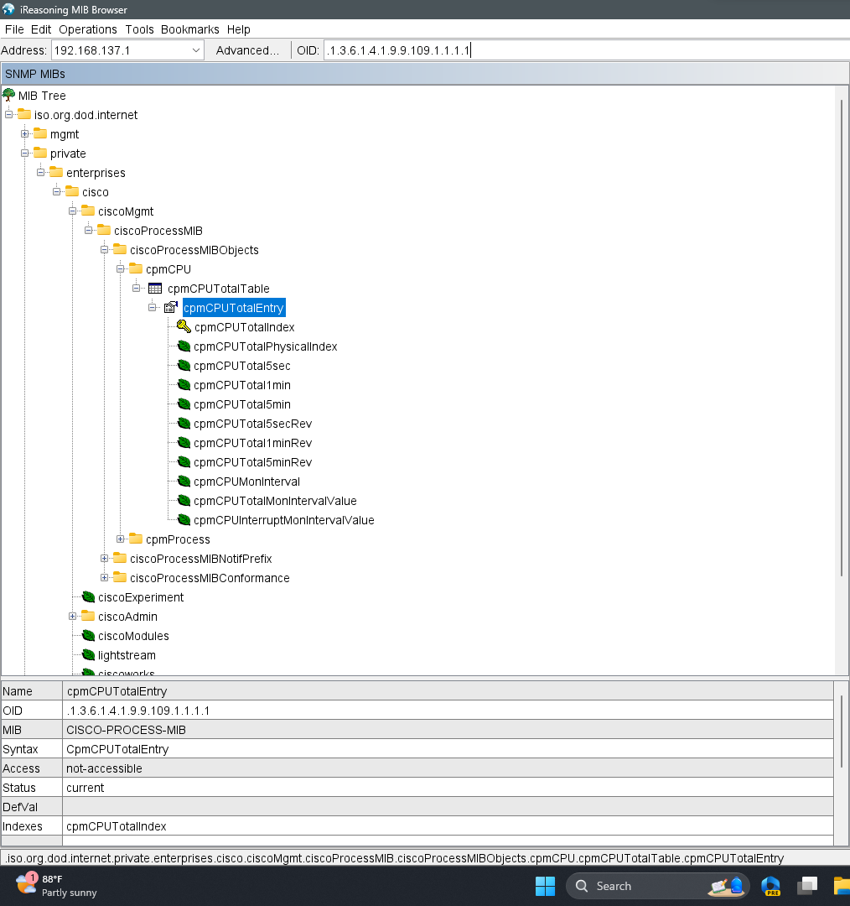

getAllDevices() -> GET: http://localhost:8080/api/devices
      // trả về List DeviceEntity
      return {
            
      }

addDevice(deivce) -> POST: http://localhost:8080/api/devices
      // body param: , id cho 0, tạo mới id, UUID.randomUUID().toString()
      // return về DeviceEntity mới tạo
getDeviceById(id) -> GET: http://localhost:8080/api/devices/{id}
      // return về DeviceEntity

getDeviceSettingsById(id) -> GET: http://localhost:8080/api/devices/{id}/settings
      // return DeviceSettings
updateDeviceSettingsById(id, deviceSettings) -> PUT: http://localhost:8080/api/devices/{id}/settings
      // body param: deviceSettings
      // return DeviceSettings

getDeviceOIDsById(id) -> GET: http://localhost:8080/api/devices/{id}/oids
      // return List DeviceOIDs
addDeviceOIDsById(id, deviceOID) -> POST: http://localhost:8080/api/devices/{id}/oids
      // body param: deviceOID
      // return deviceOID
deleteDeviceOIDsById(id, deviceOID) -> DELETE: http://localhost:8080/api/devices/{id}/oids/{oidId}
      // return DeviceOID

getDeviceOIDSettingsById(id, oidId) -> GET: http://localhost:8080/api/devices/{id}/oids/{oidId}/settings
      // return DeviceOIDSettings
updateDeviceOIDSettingsById(id, oidId, deviceOIDSettings) -> PUT: http://localhost:8080/api/devices/{id}/oids/{oidId}/settings
      // body param: deviceOIDSettings
      // return DeviceOIDSettings

getDeviceOIDValuesById(id, oidId, from, to) -> GET: http://localhost:8080/api/devices/{id}/oids/{oidId}/values?from={from}&to={to}
      // from, to: yyyy-MM-dd, query param
      // lấy dữ liệu từ from đến to
      // return List DeviceOIDValues
generateDeviceOIDValuesById(id, oidId) -> POST: http://localhost:8080/api/devices/{id}/oids/{oidId}/values
      // bên server tự gọi snmp lấy giá trị và lưu vào db sao đó trả về phần tử đầu tiên trong DeviceOIDValues
      // return DeviceOIDValues.GetFirst()

getDeviceOIDChildOIDsById(id, oidId) -> GET: http://localhost:8080/api/devices/{id}/oids/{oidId}/childoids
      // return List DeviceOIDs
getDeviceOIDCHildOIDById(id, oidId, childOidId) -> GET: http://localhost:8080/api/devices/{id}/oids/{oidId}/childoids/{childOidId}
      // return DeviceOID
addDeviceOIDChildOIDsById(id, oidId, deviceOID) -> POST: http://localhost:8080/api/devices/{id}/oids/{oidId}/childoids
      // body param: deviceOID
      // return deviceOID
deleteDeviceOIDChildOIDsById(id, oidId, childOidId) -> DELETE: http://localhost:8080/api/devices/{id}/oids/{oidId}/childoids/{childOidId}
      // return DeviceOID

deleteDevice(id) -> DELETE: http://localhost:8080/api/devices/{id}
      // return DeviceEntity

        Mỗi nhà sản xuất thiết bị mạng, như Cisco, Juniper, hoặc HP, cung cấp các tập tin MIB cho các sản phẩm của họ.

        Các tập tin MIB này chứa định nghĩa của các đối tượng mà SNMP có thể truy vấn và quản lý trên các thiết bị của nhà sản xuất đó.

        Các công cụ quản lý mạng, như SNMP Manager hoặc MIB Browser, sử dụng MIB để tạo ra các yêu cầu truy vấn và hiển thị thông tin từ các thiết bị mạng.

        Các tập tin MIB của mỗi nhà sản xuất thường đi kèm với phần mềm quản lý mạng của họ hoặc có thể tải xuống từ trang web hỗ trợ của nhà sản xuất.

        Chúng thường được cung cấp dưới dạng các tệp tin văn bản với định dạng chuẩn, nhưng được đặt phần mở rộng là ".mib" hoặc ".txt".

        Các tập tin MIB này cung cấp cho các công cụ quản lý mạng (như SNMP Manager hoặc MIB Browser) thông tin về cú pháp và ý nghĩa của các đối tượng (objects)

        mà SNMP có thể truy vấn và quản lý trên các thiết bị của nhà sản xuất đó. Thông qua tập tin MIB, các công cụ này có thể hiển thị danh sách các đối tượng,

        OID (Object Identifier) tương ứng và thuộc tính của chúng.

        Quản trị viên mạng có thể sử dụng các tập tin MIB này để truy vấn và thu thập thông tin từ các thiết bị mạng của nhà sản xuất tương ứng,

        cũng như để theo dõi và quản lý các thành phần mạng.

- CISCO-PROCESS_MIB

        CISCO-PROCESS-MIB là một MIB (Management Information Base) của Cisco được sử dụng để giám sát và quản lý quá trình (process)

        trong các thiết bị mạng Cisco thông qua SNMP (Simple Network Management Protocol).

        MIB này cung cấp các đối tượng (objects) và các thuộc tính liên quan đến quá trình (process) trong hệ thống Cisco,

        cho phép quản trị viên mạng thu thập thông tin về sử dụng CPU và bộ nhớ của các quá trình đang chạy trên thiết bị.

        Dưới đây là một số ví dụ về các đối tượng (objects) quan trọng trong CISCO-PROCESS-MIB:

        - cpmCPUTotal5minRev (.1.3.6.1.4.1.9.9.109.1.1.1.1.8): Đối tượng này cung cấp tỷ lệ sử dụng CPU trong 5 phút gần nhất trên thiết bị Cisco.

        - cpmCPUTotalPhysicalIndex (.1.3.6.1.4.1.9.9.109.1.1.1.1.2): Đối tượng này cung cấp danh sách các chỉ mục (index) của các CPU vật lý trên thiết bị.

        - cpmCPUTotalEntry (.1.3.6.1.4.1.9.9.109.1.1.1.1): Đối tượng này cung cấp thông tin chi tiết về sử dụng CPU của từng CPU trên thiết bị,

        bao gồm tỷ lệ sử dụng, thời gian sử dụng, thông tin về quá trình, ...

  

  -  Video
    
    
  

  

        Thông qua các đối tượng và thuộc tính trong CISCO-PROCESS-MIB, quản trị viên có thể theo dõi sử dụng CPU của các quá trình,
        xác định quá trình nào đang sử dụng nhiều CPU, kiểm tra tình trạng tải CPU trên thiết bị Cisco và thực hiện các biện pháp quản lý và điều chỉnh hợp lý. 

- Các thông tin cơ bản có thể nhận được từ SNMP
  
  
      Using SNMP, you can retrieve various types of information from a Cisco device. Here are some examples:

      1. System Information:
      - System description (sysDescr)
      - System name (sysName)
      - System location (sysLocation)
      - System contact (sysContact)
      - System uptime (sysUpTime)

      2. Interface Statistics:
      - Interface status (ifOperStatus)
      - Input/output bytes or packets on an interface (ifInOctets, ifOutOctets, ifInUcastPkts, ifOutUcastPkts, etc.)
      - Interface speed (ifSpeed)
      - Interface errors and discards (ifInErrors, ifOutErrors, ifInDiscards, ifOutDiscards)

      3. CPU and Memory Utilization:
      - CPU utilization (ciscoProcessCPU, cpmCPUTotal5minRev)
      - Memory utilization (ciscoMemoryPoolUsed)

      4. Network Routing and IP Addressing:
      - Routing table (ipRouteTable)
      - ARP table (ipNetToMediaTable)
      - IP address information (ipAdEntAddr, ipAdEntNetMask, ipAdEntIfIndex)

      5. VLAN Configuration and Trunking:
      - VLAN information (vlanTrunkPortDynamicStatus, vlanTrunkPortEncapsulationOperType)
      - Trunking status (dot1qTrunkPortStatus)

      6. Network Device Performance and Health:
      - Temperature (ciscoEnvMonTemperatureStatusValue)
      - Fan status (ciscoEnvMonFanStatusValue)
      - Power supply status (ciscoEnvMonSupplyStatusValue)
      - Interface bandwidth utilization (ifInOctets, ifOutOctets, ifSpeed)

      7. Network Security:
      - SNMP community strings (snmpCommunityTable)
      - Access control lists (ciscoAccessControlListName, ciscoAccessControlListAction)
      

[
      {
            _id,                                
            deviceSettings: {
                  deviceName: R1,
                  deviceType: Router,
                  deviceIpv4: 192.168.137.1,
                  deviceIcon: ,
                  monitorStatus: true,
                  priority: 5,
                  snmpVersion: v2c,
                  snmpCommunity: public,
                  snmpPort: 161,
            },
            deviceOIDs: [
                  {
                        deviceOIDId,           // int auto increment (0 ->)
                        deviceOIDValues: [
                              {
                                    date: 2021-08-10T12:00:00.000Z,
                                    value: R1
                              },
                              {
                                    date: 2021-08-10T12:00:00.000Z,
                                    value: R1
                              },
                              ...
                        ],
                        deviceOIDSettings: {
                              sensorName: sysName,
                              oidKey: .1.3.6.1.2.1.1.5.0,
                              priority: 5,
                              valueType: String,
                              pause: false,
                              unit: null,
                        }
                        childDeviceOID: [
                              {
                                    deviceChildOIDId,           // int auto increment (0 ->)
                                    deviceOIDValues: [
                                          {
                                                date: 2021-08-10T12:00:00.000Z,
                                                value: R1
                                          },
                                          {
                                                date: 2021-08-10T12:00:00.000Z,
                                                value: R1
                                          },
                                          ...
                                    ],
                                    deviceOIDSettings: [
                                          sensorName: sysName,
                                          oidKey: .1.3.6.1.2.1.1.5.0,
                                          priority: 5,
                                          valueType: String,
                                          pause: false,
                                          unit: null,
                                    ]
                              },
                              ...
                        ]
                  },
                  ...
            ]
      }
      , ...
]

// !Done
getAllDevices() -> GET: http://localhost:8080/api/devices
      // trả về {id, deviceName}, tạo model mới để trả về 
      return {
            id,
            deviceName,
      }

// param device = deviceEntity
addDevice(device) -> POST: http://localhost:8080/api/devices
      // return về DeviceEntity 
      return {
            id,
            deviceSettings: {
                  deviceName,
                  deviceType,
                  deviceIpv4,
                  priority,
                  timeout,
                  snmpVersion,
                  snmpCommunity,
                  snmpPort,
            },
            deviceOIDs: [
                  {
                        deviceOIDValues: [
                              {
                                    date,
                                    value,
                              },
                              {
                                    date,
                                    value,
                              },
                        ],
                        deviceOIDSettings: {
                              sensorName,
                              oidKey,
                              priority,
                              pause,
                              valueType,
                              unit,
                        }
                        childOID: [
                              {
                                    deviceOIDValues: [
                                          {
                                                date,
                                                value,
                                          },
                                          {
                                                date,
                                                value,
                                          },
                                          ...
                                    ],
                                    deviceOIDSettings: [
                                          sensorName,
                                          oidKey,
                                          priority,
                                          valueType,
                                          unit,
                                          pause,
                                    ]
                              },
                        ]
                  },
            ]
      }

// !Done
getDeviceById(id) -> GET: http://localhost:8080/api/devices/{id}
      // return về DeviceEntity 
      return {
            id,
            deviceSettings: {
                  deviceName,
                  deviceType,
                  deviceIpv4,
                  priority,
                  timeout,
                  snmpVersion,
                  snmpCommunity,
                  snmpPort,
            },
            deviceOIDs: [
                  {
                        deviceOIDValues: [
                              {
                                    date,
                                    value,
                              },
                              {
                                    date,
                                    value,
                              },
                              ...
                        ],
                        deviceOIDSettings: {
                              sensorName,
                              oidKey,
                              priority,
                              valueType,
                              unit,
                        }
                        childOID: [
                              {
                                    deviceOIDValues: [
                                          {
                                                date,
                                                value,
                                          },
                                          {
                                                date,
                                                value,
                                          },
                                          ...
                                    ],
                                    deviceOIDSettings: [
                                          sensorName,
                                          oidKey,
                                          priority,
                                          valueType,
                                          unit,
                                    ]
                              },
                              ...
                        ]
                  },
                  ...
            ]
      }

// !Done
getDeviceSettingsById(id) -> http://localhost:8080/api/devices/{id}/settings
      // return DeviceSettings
      return {
            deviceName,
            deviceType,
            deviceIpv4,
            priority,
            timeout,
            snmpVersion,
            snmpCommunity,
            snmpPort,
      }

// !Done
getDeviceOIDsById(id) -> http://localhost:8080/api/devices/{id}/oids
      // return List DeviceOIDs
      return [
            {
                  deviceOIDValues: [
                        {
                              date,
                              value,
                        },
                        {
                              date,
                              value,
                        },
                        ...
                  ],
                  deviceOIDSettings: {
                        sensorName,
                        oidKey,
                        priority,
                        valueType,
                        unit,
                  }
                  childOID: [
                        {
                              deviceOIDValues: [
                                    {
                                          date,
                                          value,
                                    },
                                    {
                                          date,
                                          value,
                                    },
                                    ...
                              ],
                              deviceOIDSettings: [
                                    sensorName,
                                    oidKey,
                                    priority,
                                    valueType,
                                    unit,
                              ]
                        },
                        ...
                  ]
            },
            ...
      ]

// !Done
updateDeviceSettingsById(id, deviceSettings) -> http://localhost:8080/api/devices/{id}/settings
      // return DeviceSettings
      return {
            deviceName,
            deviceType,
            deviceIpv4,
            priority,
            timeout,
            snmpVersion,
            snmpCommunity,
            snmpPort,
      }

// !Done
updateDeviceOIDsById(id, deviceOIDs) -> http://localhost:8080/api/devices/{id}/oids
      // return DeviceOIDs
      return [
            {
                  deviceOIDValues: [
                        {
                              date,
                              value,
                        },
                        {
                              date,
                              value,
                        },
                        ...
                  ],
                  deviceOIDSettings: {
                        sensorName,
                        oidKey,
                        priority,
                        valueType,
                        unit,
                  }
                  childOID: [
                        {
                              deviceOIDValues: [
                                    {
                                          date,
                                          value,
                                    },
                                    {
                                          date,
                                          value,
                                    },
                                    ...
                              ],
                              deviceOIDSettings: [
                                    sensorName,
                                    oidKey,
                                    priority,
                                    valueType,
                                    unit,
                              ]
                        },
                        ...
                  ]
            },
            ...
      ]

! Done
deleteDeviceById(id) -> http://localhost:8080/api/devices/{id}
      return {
            id,
            deviceName,
      }

