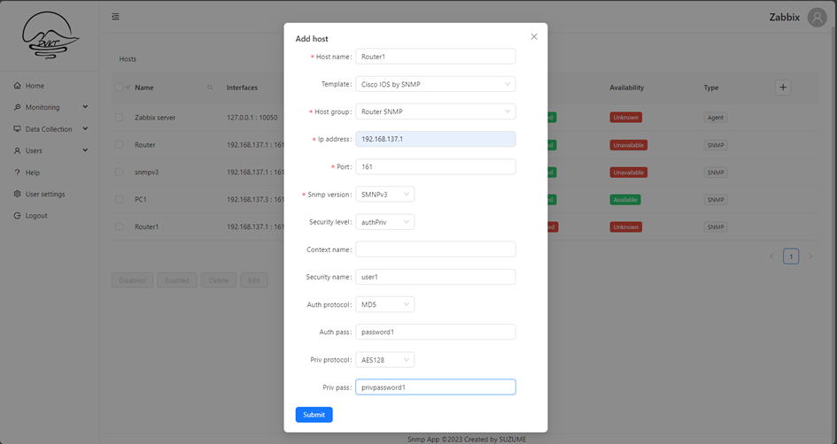
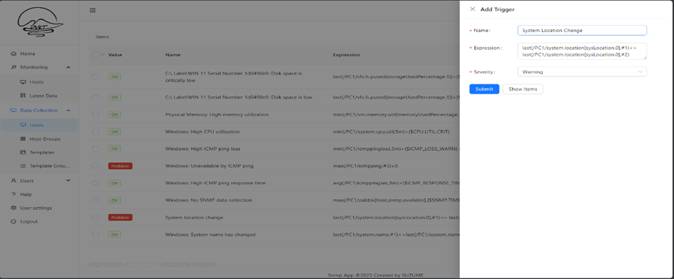
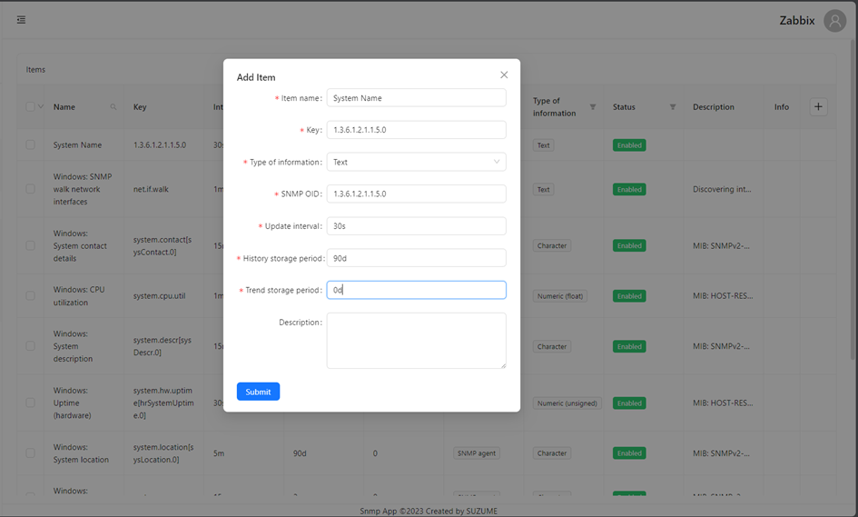
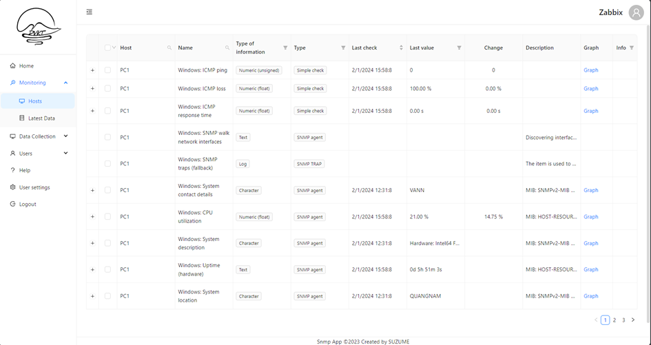
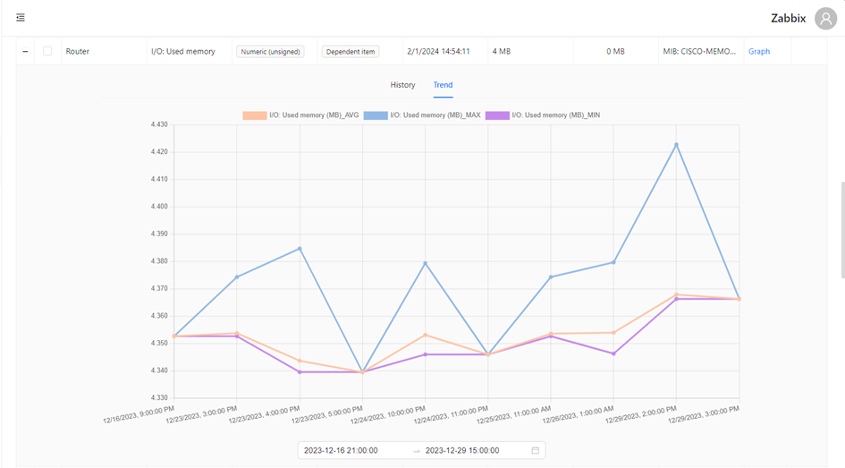
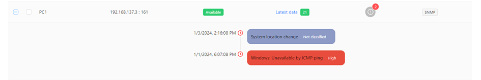

# Zabbix API Network Monitoring Application
> Detailed documentation: 
-   [Zabbix API Network Monitoring Application (1)]('/Document.pdf)
-   [Zabbix API Network Monitoring Application (2)]('/Cisco.md)

Zabbix Monitor Application is built using the Zabbix API, which allows it to interact with the Zabbix server to retrieve monitoring data, configure monitoring settings, and receive alerts. The application provides a user-friendly interface to visualize monitoring data, configure monitoring parameters, and manage alerts and notifications. It is designed to be scalable, flexible, and customizable to meet the monitoring needs of various IT environments.

# Purpose
The purpose of the Zabbix Monitor Application is to provide a comprehensive monitoring solution for IT infrastructure, enabling organizations to maintain high availability, performance, and security of their network resources and services. It aims to simplify the monitoring process, improve visibility into system performance, and facilitate proactive management of IT resources. By leveraging the Zabbix API, the application can integrate with existing monitoring systems and provide a unified platform for monitoring and managing network devices, servers, and applications.

# Features

- Real-time Monitoring: The application leverages the Zabbix API to gather data from network devices, servers, and applications in real-time. It provides up-to-date information about system performance, network bandwidth, server health, and more.
- Alerting and Notifications: The application utilizes the Zabbix API's alerting capabilities to notify users of any critical issues or threshold breaches. Users can configure customized alerts and receive notifications through various channels such as email, SMS, or instant messaging.
- Historical Data Analysis: The application stores historical monitoring data obtained through the Zabbix API. Users can analyze trends, generate reports, and gain insights into the performance of the network over time. This helps in identifying potential bottlenecks, optimizing resource allocation, and planning for future scalability.
- User Login & Sign up
  
# Getting Started
To get started with the Zabbix API Network Monitoring Application, follow these steps:
1.    **Install and Configure Zabbix Server**:
    Begin by installing the Zabbix server on your network. Follow the official installation guide provided by Zabbix to set up and configure the server correctly. The installation process may vary depending on your operating system and environment. 

        >   You can download the Zabbix server installation package from the official website:
    https://www.zabbix.com/download?zabbix=6.4&os_distribution=ubuntu&os_version=22.04&components=server_frontend_agent&db=mysql&ws=apache


2.  **Prepare Network Devices, Servers, and Applications**: Identify the network devices, servers, and applications that you want to monitor using the Zabbix API. Make sure these devices are compatible with Zabbix monitoring. Configure the necessary monitoring parameters on these devices, such as SNMP settings or agent installation.
    -   Install and Configure Zabbix Agent: Install the Zabbix agent on the network devices and servers that you want to monitor. Configure the agent to communicate with the Zabbix server and provide the necessary monitoring data.
    -   Enable SNMP on Network Devices: For network devices that support SNMP, enable and configure SNMP settings to allow Zabbix to monitor these devices using SNMP. 
        > Enable snmp on router: https://sss.net.vn/docs/cau-hinh-snmp-tren-router-switch-dua-tren-ios-cua-cisco

        > Enable snmp on pc: https://kdata.vn/tin-tuc/huong-dan-cach-cai-dat-va-cau-hinh-snmp-tren-windows-10

3.  **Enable Zabbix API Access:** Enable the Zabbix API on your Zabbix server. This can usually be done through the Zabbix server configuration file. Set the appropriate API access permissions and authentication method to ensure secure access.
    >   Zabbix API Documentation: Refer to the official Zabbix API documentation to learn about the available API methods, authentication, and usage guidelines. (https://www.zabbix.com/documentation/6.4/manual/api)
4.  **Start Monitoring**: Start monitoring your network systems and utilize the features of the application to gain insights, receive alerts, and make data-driven decisions to optimize your network performance.

  
# How to install?

You can install this application on your server or local machine. To install this application, follow these steps:
1.  **Clone the Repository**: Clone the repository to your local machine using the following command:
    ```
    git clone https://github.com/dinhvan2310/pbl4_snmp_ui.git
    ```

2.  **Install Dependencies**: Navigate to the project directory and install the necessary dependencies using the following command:
    ```
    npm install
    ```

3.  **Change API URL**: Open the `.env` file and change the `REACT_APP_API_URL` to the URL of your Zabbix server API. For example:
    ```
    REACT_APP_API_URL=http://your-zabbix-server/api_jsonrpc.php
    ```

4.  **Run the Application**: Once the dependencies are installed, you can run the application using the following command:
    ```
    npm start
    ```
    The application will start running on your local server. You can access it by opening a web browser and navigating to `http://localhost:3000`.


# Preview:








# Tools used
- ReactJs
- Axios
- AntDesign
- React-Router-Dom


# Authors
- Dinh Van
- Kim Tien

